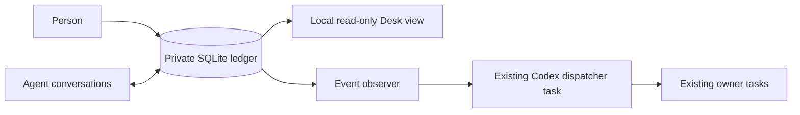

# How Agent Desk fits together

The ledger records assertions and history; it does not authenticate the outside systems those assertions describe. Agents verify source evidence before they write. The observer reads local changes and produces a bounded wake attempt. A successful queue response means only that a wake was queued. The dispatcher and owner must separately accept and complete the work.

No process in this repository creates a model task automatically. The user chooses the initial conversations. The dispatcher has no special authority to merge code, deploy, spend money, publish, or send external messages. It may route an event only to a registered owner within that owner's existing authorization.

The web view intentionally has no mutation API. Human decisions can be recorded by a trusted local agent using the CLI after the agent confirms the exact request and actor. Exposing a write API would require its own authentication design.

State is private and portable: `AGENT_DESK_HOME` moves the ledger and dispatcher files; `DESK_DB` overrides only the ledger path for tests or migrations. Back up both before moving machines. The UI is a projection and can be restarted without changing ledger state.
